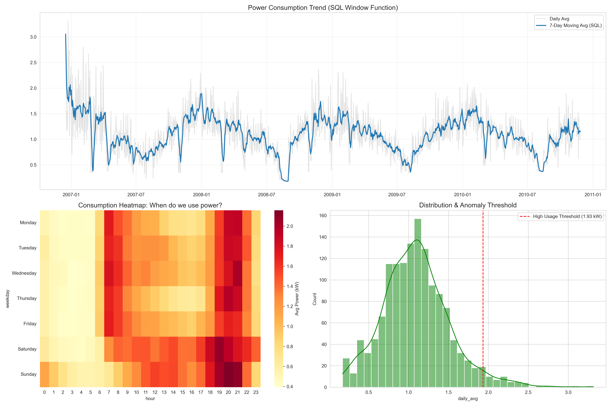

# ⚡ Smart Meter Energy Analytics & SQL Pipeline


## 📋 Project Overview
This project demonstrates an end-to-end **Data Analytics Pipeline** designed to process high-frequency energy consumption data. The goal is to simulate a real-world scenario for an Energy Service Provider (like ista or 1KOMMA5°) where raw meter data needs to be cleaned, transformed, and aggregated into actionable business insights.

The project moves beyond simple Pandas aggregation by implementing **Advanced SQL Window Functions** to calculate rolling averages and identify trends directly within the database layer.

## 📊 The Dashboard
*Below is a snapshot of the generated analysis, featuring SQL-calculated trends, consumption heatmaps, and anomaly detection.*



---

## 🛠 Tech Stack
* **Language:** Python 3.x
* **Data Manipulation:** Pandas, NumPy
* **Database:** SQLite (In-Memory)
* **Visualization:** Matplotlib, Seaborn
* **Environment:** Jupyter Notebook

## 📂 Project Structure
```text
Smart-Meter-Analysis/
├── data/                   # Contains raw dataset (household_power_consumption.txt)
├── notebooks/              # Jupyter Notebooks for analysis
│   └── analysis.ipynb      # Main ETL and Analysis logic
├── dashboard_preview.png   # Generated visualization
├── requirements.txt        # Python dependencies
└── README.md               # Project documentation